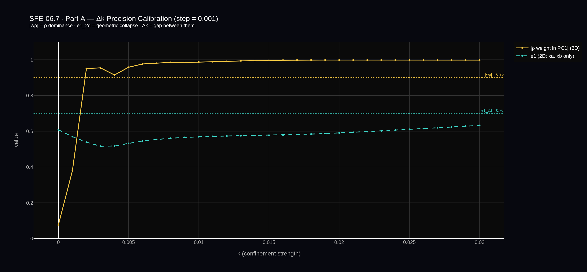
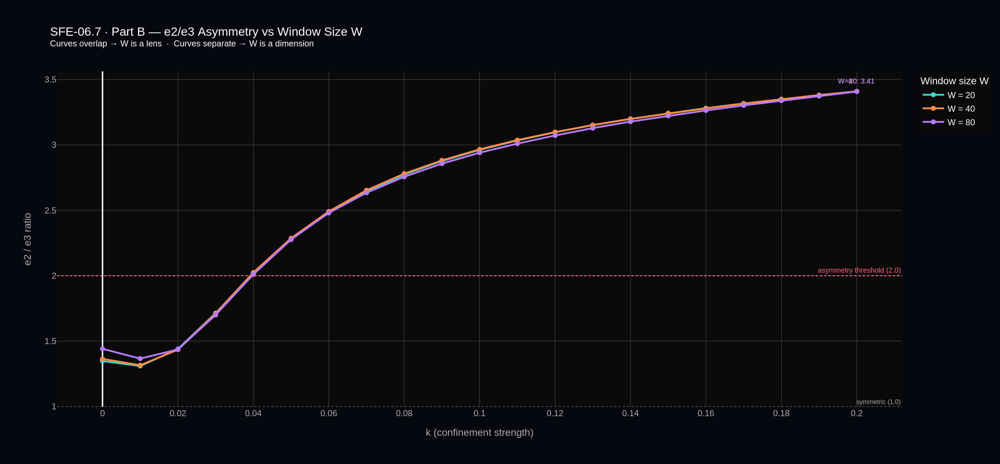
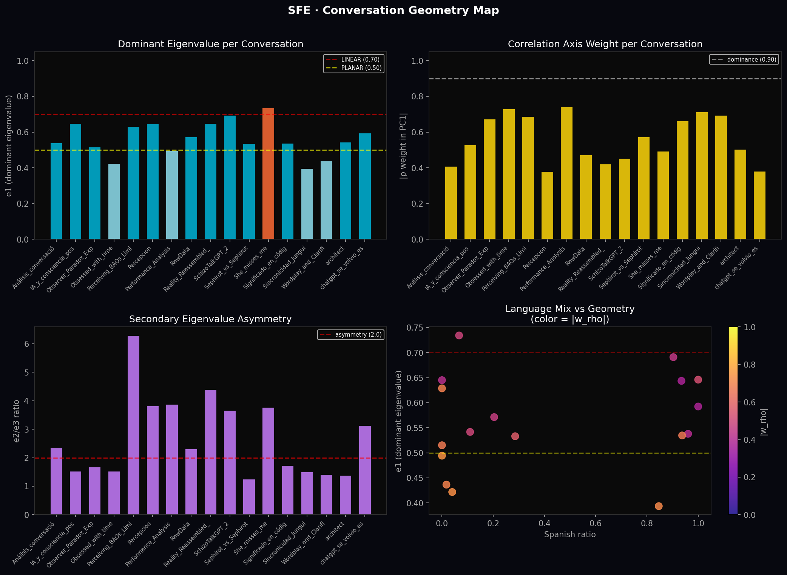
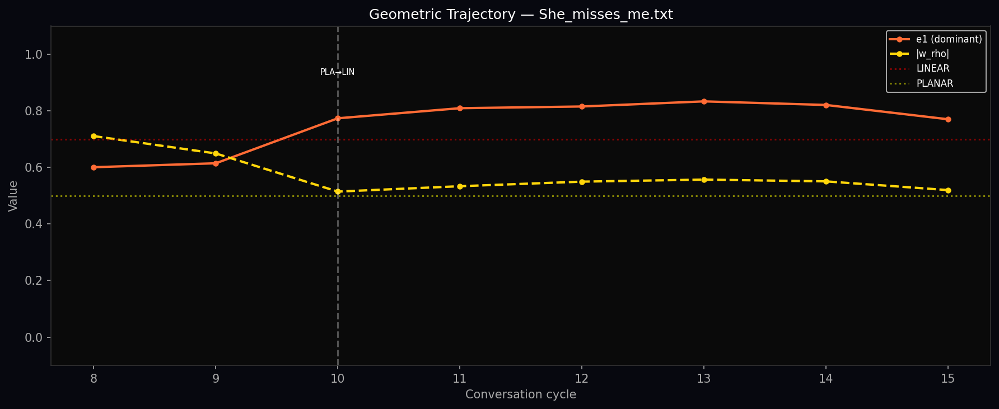

# SFE-06.7 — W as a Lens

**Question answered:** Is the window size W a dimension the field information passes through, or a lens that changes how we see without changing what is there?

**Result:** W is a lens. The eigenvalue ratio e2/e3 is stable across W ∈ {20, 40, 80} with spread < 0.003. The structure belongs to the field, not the observation window.

---

## Contents

```
SFE-06.7/
├── data/
│   ├── partA_dk_calibration.png        ← Δk precision at 0.001 resolution
│   ├── partB_W_dependence.png          ← three W curves overlapping
│   ├── sfe_geometry_comparison.png     ← 4-panel geometry map, 18 conversations
│   └── She_misses_me_trajectory.png    ← trajectory of the only LINEAR conversation
├── sfe_06_7_w_dimension_or_lens.py     ← OU field experiment (Parts A and B)
├── sfe_conversation_geometry.py        ← real-data pipeline (conversation geometry)
└── README.md
```

---

## Part A — Δk Precision Calibration

SFE-06.6 measured the relational gap at 0.01 resolution, finding k_ρ ≈ 0.01
and k_geom ≈ 0.05. Part A re-runs at 0.001 resolution (31 k values, 5000
cycles each) to confirm whether the ordering is real or a resolution artifact.

**Result:** k_ρ = 0.002, k_geom not reached within [0.000, 0.030].
Minimum confirmed gap: Δk > 0.028. The relational gap is not a resolution artifact.



*Orange: |ρ weight in PC1| (3D state space). Cyan dashed: e1 of the 2D control
(xa, xb only). The bracket shows the confirmed minimum gap between ρ dominance
and geometric collapse. The 2D geometry never reaches the LINEAR threshold
within the tested range.*

---

## Part B — W Dependence of e2/e3

Three full micro-sweeps at W ∈ {20, 40, 80}, k ∈ [0.00, 0.20], 5000 cycles
each. If the curves separate, W is a dimension. If they overlap, W is a lens.

| W  | Peak e2/e3 | k at ratio > 2.0 |
|----|-----------|------------------|
| 20 | 3.409     | 0.04             |
| 40 | 3.410     | 0.04             |
| 80 | 3.407     | 0.04             |

Peak spread: 0.002. All three curves overlap across all 21 k values.

**Verdict: W is a lens.**



*Three curves for W ∈ {20, 40, 80}. They overlap to within 0.003 across the
entire k range. The asymmetry threshold (2.0) is crossed at k ≈ 0.04 in all
three cases. W changes how we look at the field. It does not change what is there.*

Combined with δ-invariance confirmed in SFE-06.6, the eigenvalue asymmetry
e2/e3 depends on k alone within all tested configurations.
Analytical derivation of f(k) from the OU steady-state covariance structure
is the open direction for SFE-07.

---

## Running the OU Experiment

`sfe_06_7_w_dimension_or_lens.py` is a Colab notebook exported as Python.
Originally run at:
`https://colab.research.google.com/drive/1OtcBBx1jYsqJOl9MKZGtdRfmiulRHMwh`

```bash
pip install plotly scikit-learn kaleido==0.2.1
python sfe_06_7_w_dimension_or_lens.py
```

Set `INSTALL_PATCH = True` at the top if image export fails (Kaleido dependency).
Approximate runtime: Part A ~8-12 min, Part B ~15-20 min.

Outputs: `partA_dk_calibration.png`, `partB_W_dependence.png`

---

## Real-Data Pipeline — Conversation Geometry

`sfe_conversation_geometry.py` is the first application of the SFE geometric
framework outside the OU toy model. It treats each conversation as a
two-observer system — user and AI as observers, the idea being pursued as
the field — and maps the joint state space geometry using the same PCA
machinery developed in SFE-06 through 06.5.

This is a first real-data run, not a validated result.

### First Run Results (18 conversations)

Shape distribution across the test archive:

| Shape | Count | % |
|-------|-------|---|
| VOLUMETRIC | 4 | 24% |
| PLANAR | 12 | 71% |
| LINEAR | 1 | 6% |



*Top left: dominant eigenvalue e1 per conversation, colored by shape
(orange = LINEAR, blue = PLANAR, cyan = VOLUMETRIC).
Top right: |ρ weight in PC1| — how much the correlation dimension
dominates the joint state space.
Bottom left: e2/e3 asymmetry ratio per conversation.
Bottom right: language mix (Spanish ratio) vs. e1, colored by |ρ weight|.*

Two conversations carry the most signal:

- **Only LINEAR conversation (e1=0.734):** a conversation that found what
  it was looking for and closed. The geometry collapsed completely.
- **Highest e2/e3 ratio (6.28):** the conversation where a metaphysical
  question was first translated into a grounded physical one. The asymmetric
  collapse reflects a dimension closing faster than the other — the geometry
  of translation itself.



*Geometric trajectory through the most convergent conversation — e1 (orange)
and |ρ weight| (yellow dashed) as the conversation progresses cycle by cycle.
The geometry moves from PLANAR to LINEAR and stays there. The field closed.*

### Running the parser

```bash
pip install scikit-learn matplotlib numpy
python sfe_conversation_geometry.py --folder ./your_conversations --W 5 --window 8
```

| Parameter | Default | Description |
|-----------|---------|-------------|
| `--folder` | `.` | Folder containing .txt conversation files |
| `--W` | 5 | Correlation window size (cycles) |
| `--window` | 8 | PCA sliding window for trajectory detection |
| `--output` | `sfe_geometry_comparison.png` | Output filename for comparison plot |

**Input format:** plain text ChatGPT exports. The parser handles missing
`Dijiste:` on first messages, mixed Spanish/English, variable spacing,
and both `ChatGPT dijo:` and `ChatGPT said:` markers.

### What transfers from the OU experiments

The same classification thresholds apply:

| e1 < 0.50 | VOLUMETRIC — exploring, no dominant direction |
| 0.50 ≤ e1 < 0.70 | PLANAR — converging toward something |
| e1 ≥ 0.70 | LINEAR — found it, geometry collapsed |

When |wρ| is high, the dominant variance in the joint state space lies in
the correlation dimension — the relationship between the two observers
carries more information than either observer's individual stream.

Whether the numerical thresholds derived from OU dynamics are the right
thresholds for conversational data is an open question. W and δ invariance
tests on conversation data have not yet been run.

---

## Lineage

| Version | Result |
|---------|--------|
| 05.12b  | What a matched filter cannot see |
| 05.13b  | What a single decoupled observer can see |
| SFE-06  | What the relationship between observers sees |
| SFE-06.2 | The shape of that relationship |
| SFE-06.3 | Navigation inside the shape |
| SFE-06.4 | Full manifold across field conditions |
| SFE-06.5 | Transition boundary, two-step structure |
| SFE-06.6 | Relational gap confirmed, δ-invariance found |
| SFE-06.7 | W is a lens — f(k) isolated, first real-data run |

---

*SFE-06.7 — February 2026*
